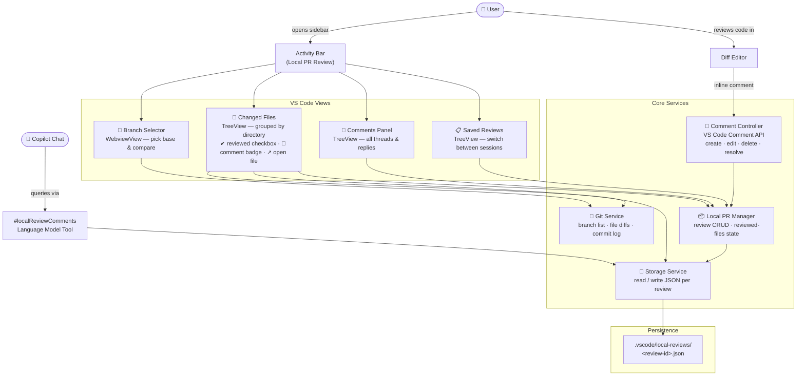
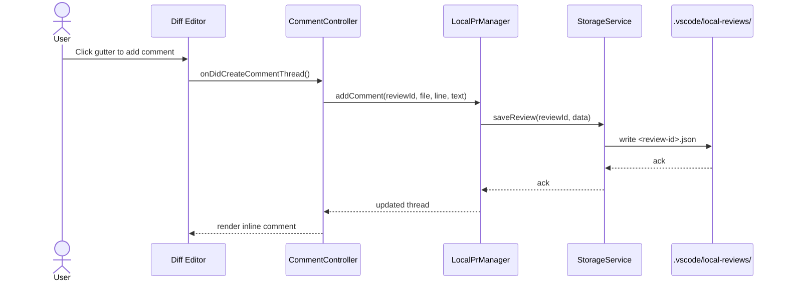
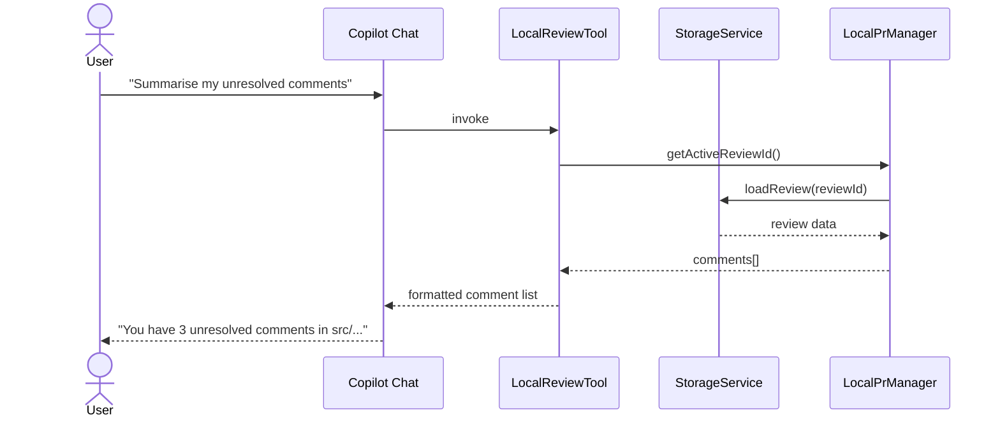

# Architecture

This document describes the internal architecture of the **Local PR Review** VS Code extension.

---

## High-Level Flow



---

## Data Flow — Adding a Comment



---

## Data Flow — Copilot Query



---

## Module Map

| Module | Path | Responsibility |
|---|---|---|
| `extension.ts` | `src/` | Entry point — registers all views, commands, and event handlers |
| `GitService` | `src/git/` | Wraps VS Code Git API + `child_process` for diff, branch list, commits |
| `CommentController` | `src/comments/` | Manages all inline comment threads via the VS Code Comment API |
| `LocalPrManager` | `src/services/` | Review CRUD — create, load, save, delete, reviewed-file state |
| `StorageService` | `src/storage/` | Reads and writes review JSON to `.vscode/local-reviews/` |
| `BranchSelectorWebviewProvider` | `src/views/` | WebviewView panel for branch selection |
| `ChangedFilesProvider` | `src/views/` | TreeView — directories + files with badges, checkboxes, open-file action |
| `LocalCommentsProvider` | `src/views/` | TreeView — flat list of all comment threads and replies |
| `LocalPrsProvider` | `src/views/` | TreeView — saved review sessions |
| `LocalReviewTool` | `src/tools/` | Copilot LM Tool — exposes comments to `#localReviewComments` chat queries |

---

## Persistence Format

Each review is stored as a JSON file at `.vscode/local-reviews/<review-id>.json`:

```json
{
  "id": "uuid",
  "name": "My review",
  "baseBranch": "main",
  "compareBranch": "feature/my-feature",
  "createdAt": "2026-01-01T00:00:00.000Z",
  "reviewedFiles": ["src/foo.ts"],
  "comments": [
    {
      "id": "uuid",
      "filePath": "src/foo.ts",
      "line": 42,
      "text": "Consider extracting this to a helper",
      "resolved": false,
      "createdAt": "2026-01-01T00:00:00.000Z"
    }
  ]
}
```
