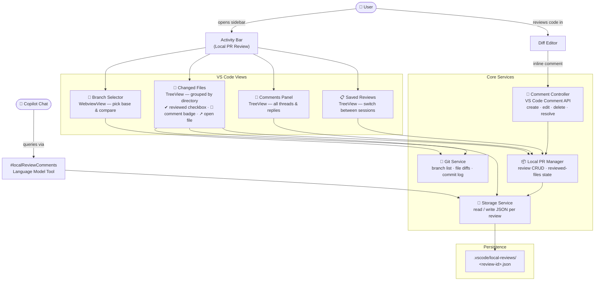

# Local PR Review

A VS Code extension for local branch diff review with offline inline comments. Review your own code changes before pushing — no GitHub/remote needed.

## Features

- **Branch Diff View** - Select base and compare branches, see all changed files
- **Inline Comments** - Add, edit, delete comments on any line in the diff
- **Resolve/Unresolve** - Toggle comment threads as resolved with a single click
- **Tree Grouping** - Files grouped by directory with file count
- **Reviewed Checkbox** - Track which files you've reviewed
- **Comment Count Badge** - See comment count per file at a glance
- **Open File** - Quick action to open the working copy from the diff view
- **Multiple Reviews** - Save and switch between review sessions
- **Copilot Integration** - Query your review comments via Copilot chat using `#localReviewComments`
- **Persistent Storage** - Comments saved as JSON in `.vscode/local-reviews/`

## Getting Started

1. Open a Git repository in VS Code
2. Click the **Local PR Review** icon in the activity bar
3. Select a **Base** branch and a **Compare** branch
4. Browse changed files, open diffs, and add comments

## Architecture

### Key modules

| Module | Path | Responsibility |
|---|---|---|
| `extension.ts` | `src/` | Entry point — registers all views, commands, and event handlers |
| `GitService` | `src/git/` | Wraps VS Code Git API + `child_process` for diff, branch list, commits |
| `CommentController` | `src/comments/` | Manages all inline comment threads via the VS Code Comment API |
| `LocalPrManager` | `src/services/` | Review CRUD — create, load, save, delete, reviewed-file state |
| `StorageService` | `src/storage/` | Reads and writes review JSON to `.vscode/local-reviews/` |
| `BranchSelectorWebviewProvider` | `src/views/` | WebviewView panel for branch selection |
| `ChangedFilesProvider` | `src/views/` | TreeView — directories + files with badges, checkboxes, open-file action |
| `LocalCommentsProvider` | `src/views/` | TreeView — flat list of all comment threads and replies |
| `LocalPrsProvider` | `src/views/` | TreeView — saved review sessions |
| `LocalReviewTool` | `src/tools/` | Copilot LM Tool — exposes comments to `#localReviewComments` chat queries |

## Roadmap

- [ ] Commits section - show commits between base and compare with message, author, and relative time
- [ ] Multi-diff editor - open all changed files in one tabbed diff view
- [ ] Go to Next/Previous Diff - keyboard nav across files
- [ ] Suggest a Change - inline code suggestion in a comment (shows a mini diff)
- [ ] Collapse/Expand All Comments
- [ ] File decorations - comment bubble on files in VS Code explorer
- [ ] Outdated comment detection - flag comments on lines that changed since commenting
- [ ] Mark as Viewed from editor toolbar
- [ ] Comment draft indicator - gutter icon showing where comments exist
- [ ] Markdown rendering in comments
